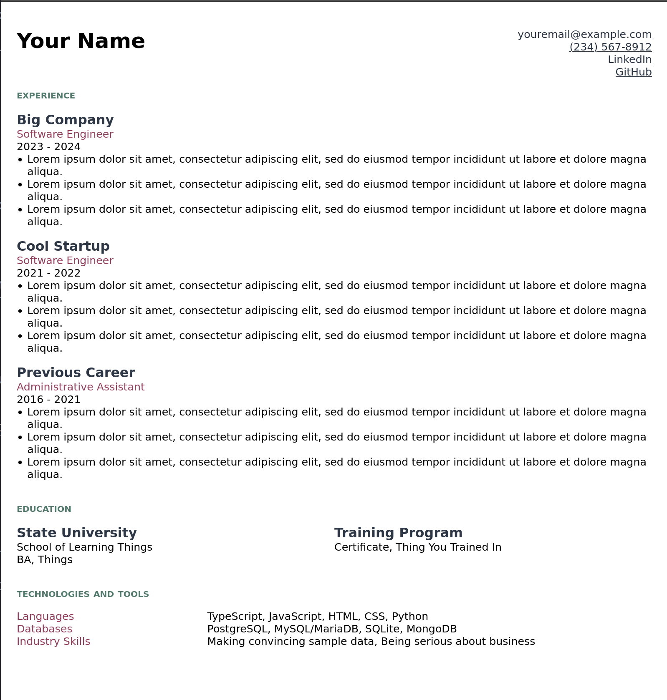
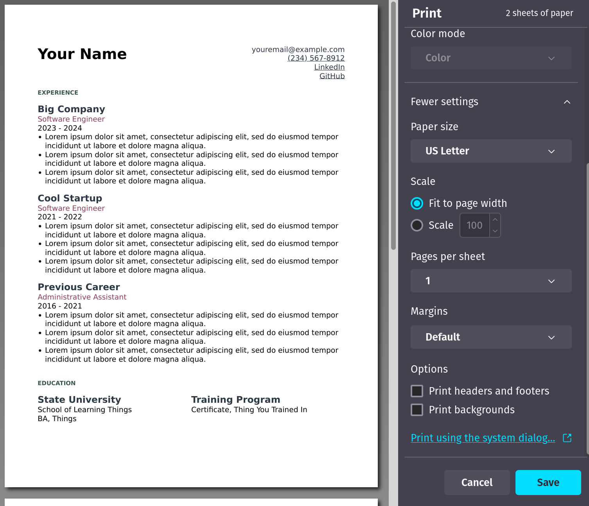

# resume-template

Welcome to way too much README for a tiny little project!

This template was developed for my own very basic resume, with the specific intention that I would print the HTML page as a PDF. It exists because I find organizing information on the page much easier in HTML and CSS than in a word processor or design program. If that's true for you as well, this template may be useful.

You can see a demo [here](https://devon-wolf.github.io/resume-template/).

The final outcome may look something like this, depending on what changes you've made:



## Project Structure

- User data is entered in `index.md`
- The main layout is `_includes/base.njk`
- Individual sections included in `base.njk` are also in the `_includes/` folder
- Style is defined in `style.css` - this is passed through to the built project as part of the configuration in `.eleventy.js`

## Prerequisites

You will need to be comfortable with using the command line, though we won't be doing anything extensive here. This guide will assume that you know how to access your command line and navigate to the directory that houses this project.

To use this template you must have `node` installed. If you do not, the most-often recommended way to install it is through `nvm`; [see nvm for instructions](https://github.com/nvm-sh/nvm). Confirm installation by running `node --version`, which should output your version number.

To clone this repository from GitHub, you will need `git` [installed](https://git-scm.com/book/en/v2/Getting-Started-Installing-Git). Confirm installation by running 
`git --version`, which should output your version number.

## Resources

This template was built with [Eleventy](https://www.11ty.dev/docs/). Consult the Eleventy docs for any questions you have about the structure, or for changes you might want to make.

## Using the Template

### Cloning the repo

On the command line, navigate to the directory where you want to save this repository. Run `git clone https://github.com/devon-wolf/resume-template.git`, then `cd resume-template` to enter the project directory.

Run `npm i` in this directory to install the required dependencies.

Open the directory in your text editor of choice to start editing.

### Adding your data

All the resume contents - the information that will be injected into the template - are found in `index.md`.

The property values in `index.md` (that is, the contents after the colons, such as `Your Name`) are intended to be freely changed in order to fill in the template with your own information.

Any list in `index.md` can be added to or removed from; the templates will iterate through however many items are provided. To add a new item to a list, simply follow the existing pattern. For example, to add a new category called `Operating Systems` to the `skills` section, add the following block below `entries`, indented the same as the other entries:
```
- category: Operating Systems
  contents:
    - Linux
    - macOS
    - Windows
```

The fields in `index.md` (that is, the words before the colons, such as `sectionTitle:` or `accomplishments:`) are for structure and do not appear on the resume itself. If you do choose to change them, be sure to change the corresponding templates in the `_includes` folder to use the new properties. For example, if you wanted to change `employer` to `project`, you would change that field in `index.md` and also change `_includes/experience.njk` to use `entry.project` in the `<h2>` element.

### Building the resume

While developing/working on your changes, you can use `npm run dev` to build the project, serve it at `localhost:8080`, and rebuild it live as you make changes. Visit `localhost:8080` in your browser to view the resume. (This port may vary if you already have something running on 8080; see the console where you ran the command for the correct URL.)

To build the resume without serving it, run `npm run build`. This will build the project and write it to the `_site/` directory, after first clearing out any existing `_site/` directory to ensure it's a clean build. I recommend running this command when you're ready to "publish" your resume, if you intend to deploy it as a web page - this will ensure that any leftover artifacts in the `_site/` directory get cleaned up.

### Making adjustments

Of course, you can change anything and everything you want. But here are a couple things that come to mind:

- To adjust the colors used, edit the following section of `style.css` to use your preferred colors for each variable:
```css
* {
  box-sizing: border-box;

  --background: white;
  --text: black;
  --primary: #2d3746;
  --secondary: #50786b;
  --accent: #94405b;
}
```

- Font can be adjusted in the `body` section of `style.css`.

- The 'Education' section was laid out for two entries on a single row. If that does not suit your needs, I'd recommend adding a new class that behaves how you like. You will need to update the`<ul>` in the `_includes/education.njk` file to use this new class.

- If the `two-col offset` class doesn't provide enough room for your skill category names, you can adjust the column size in the `.two-col.offset` section of `style.css`.

### Miscellaneous

I've included the command `npm run fix` to run the `prettier` formatter on the project. This is not necessary for using the template and should not affect the content that appears on the page. I just like having consistently formatted code. Use it if you like, ignore it if not.

There is also a `.github/workflows/static.yml` file that is configured to send this sample resume over to GitHub pages for your viewing pleasure. It should work for you as well, if you plan on hosting this on GitHub. Otherwise, this is fine to delete or ignore.

## Finishing

Once your resume looks how you want it and you've run `npm run build`, you're ready to do whatever you like with the results. The `_site/` directory contains the files needed to deploy the site, for example, with [GitHub Pages](https://pages.github.com/).

In order to have a standalone resume I can attach to job applications and emails, I like to print the page as a PDF. With the resume open in your browser, go to the print menu. In Firefox, it will look like this:



You will want to choose the 'Save as PDF' option. In Firefox, I was able to remove the autogenerated header and footer (that show the date and web address) by deselecting the 'print headers and footers' option.

